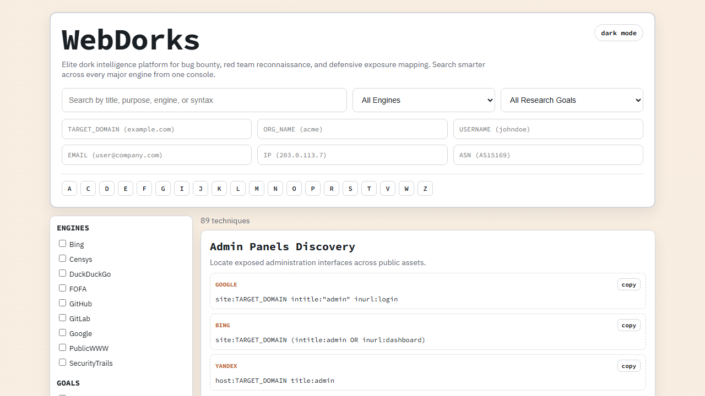

# WebDorks

Premium dork intelligence platform covering GitHub dorks, search-engine dorks, cloud exposure dorks, API dorks, and infrastructure discovery dorks in one place.

## What Changed

- Full UI/UX overhaul with cleaner navigation, stronger typography, and refined color palette.
- Expanded from a narrow list into a broad `WebDorks` catalog across GitHub, Google, Bing, Yandex, Shodan, Censys, FOFA, GitLab, and more.
- Added tokenized query generation:
`TARGET_DOMAIN`, `ORG_NAME`, `USERNAME`, `EMAIL`, `IP`, `ASN`.
- Added advanced filtering by engines and research goals, A-Z jump navigation, one-click copy, and theme toggle.

## Usage

1. Open `dorks/index.html`.
2. Fill token fields for your target context.
3. Search/filter techniques and copy generated dorks instantly.

## Important

Use only for authorized, legal security testing and responsible disclosure.
